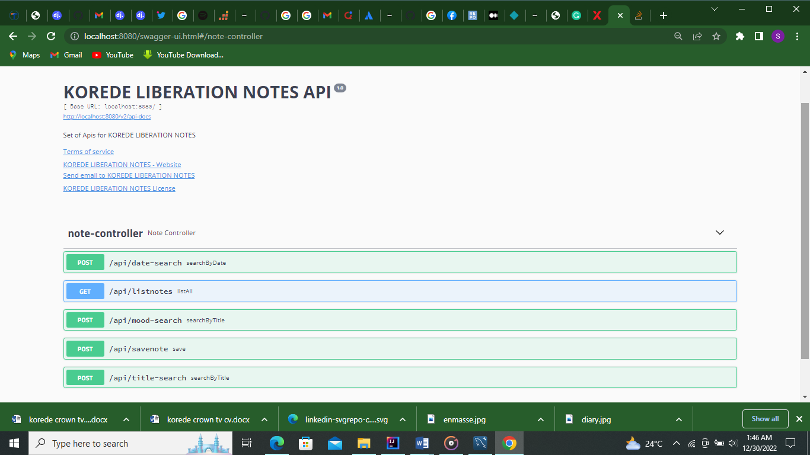

# MY-LIBERATION-NOTES API

Online Diary Version

Inspired by a Korean Drama title MY LIBERATION

My journey so far is full of highs and lows that i really wish i documented somewhere maybe Diary. Smiles, I'm a Programmer! So i made myself one.

Deliberately left out the Delete and Update features because i can't go back in time to unexperience what i've already experienced, or prevent what have happened.

Required software
The following are the initially required software pieces:

Maven: it can be downloaded from https://maven.apache.org/download.cgi#.
Git: it can be downloaded from https://git-scm.com/downloads.
Java 18.0.0: it can be downloaded from https://www.oracle.com/java/technologies/downloads/#java18.
Node.js 17.8+: Latest features, and it can be downloaded from https://nodejs. org/en/download/current/.
Angular CLI 12.2+: Install it with the following command: npm install -g @angular/cli@latest
Follow the installation guide for each software, on provided website link and check your software versions from the command line to verify that they are all installed correctly.

Cloning It
Now it is the time to open terminal or git bash command line, and then clone the project under any of your favorite places with the following command:

> git clone https://github.com/Kordedekehine/MY-LIBERATION-NOTES.git
Using an IDE
I recommend that you work with your Java code using an IDE that supports the development of Spring Boot applications such as Spring Tool Suite or IntelliJ IDEA Community | Ultimate Edition.

All you have to do is fire up your favorite IDE -> open or import the parent folder MY-LIBERATION-NOTES, and everything will be ready for you.

Building & Running The System
To build and run MY-LIBERATION-NOTES system components, run the following command:

Building MY-LIBERATION-NOTES Components
MY-LIBERATION-NOTES backend
👻 [mtaman]:MY-LIBERATION-NOTES ~~ ./mvnw clean package
Now you should expect output like this:

[INFO]
[INFO] Results:
[INFO]
[INFO] Tests run: 1, Failures: 0, Errors: 0, Skipped: 0
[INFO]
[INFO]
[INFO] --- maven-jar-plugin:3.2.0:jar (default-jar) @ liberation ---
[INFO] Building jar: C:\spring projects\liberation\target\liberation-0.0.1-SNAPSHOT.jar
[INFO]
[INFO] --- spring-boot-maven-plugin:2.5.4:repackage (repackage) @ liberation ---
[INFO] Replacing main artifact with repackaged archive
[INFO] ------------------------------------------------------------------------
[INFO] BUILD SUCCESS
[INFO] ------------------------------------------------------------------------
[INFO] Total time:  01:35 min

